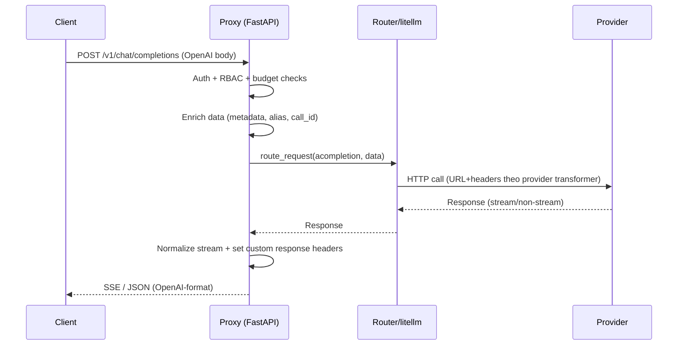
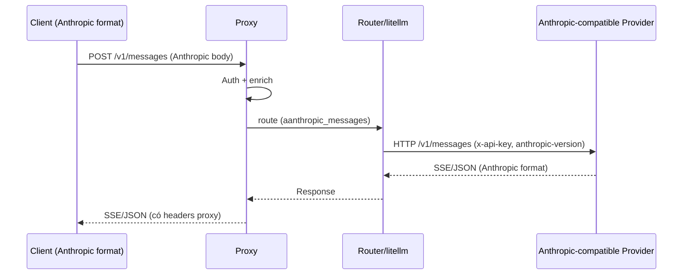
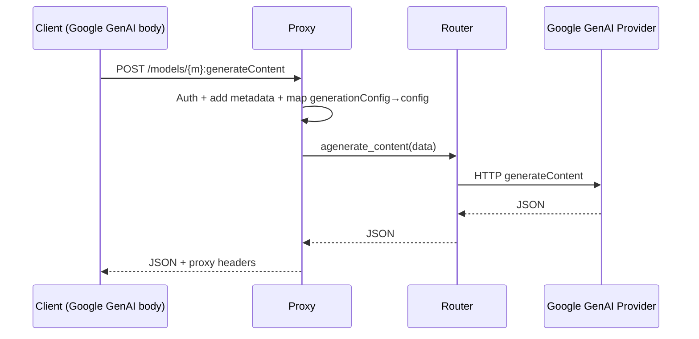
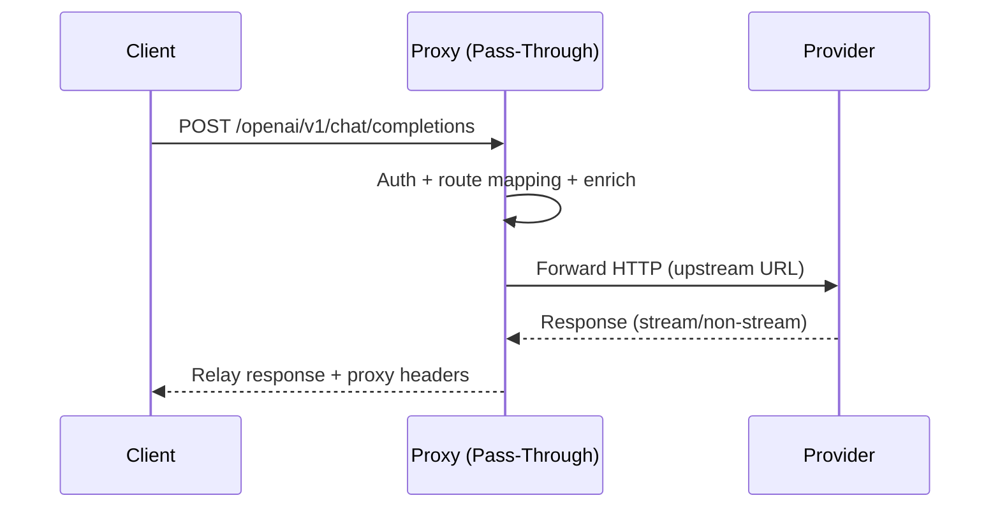

# LiteLLM Proxy – Endpoint Routing & Provider Flows

Scope

- Mô tả các endpoint “gọi thật” tới provider trong LiteLLM Proxy, cách định tuyến (routing), và chuyển đổi (transformation) giữa các API interface của từng provider.
- Định dạng: mô tả ngắn gọn + sơ đồ tuần tự (mermaid) cho các luồng phổ biến.

Common Flow

- Auth + RBAC: xác thực key, kiểm tra quyền/budget, kiểm tra route.
- Parse + enrich: đọc body, gắn metadata (call_id, team_id, headers…), map alias model.
- Routing: chọn `Router` hay gọi trực tiếp `litellm.*`. Nếu có `api_key/api_base` trong body → ưu tiên gọi trực tiếp.
- Provider transform: lớp transformer của provider quyết định URL cuối, headers và transform response.
- Streaming: chuẩn hóa về SSE OpenAI‑style và set HTTP status phù hợp nếu chunk đầu là lỗi.
- Post‑call: thêm headers (chi phí, call_id…), hook thành công/thất bại, giới hạn kích thước phản hồi.

## OpenAI-Compatible Groups

Các endpoint nhận OpenAI‑format từ client và gọi provider.

Chat Completions

- Endpoints
  - `/v1/chat/completions`, `/chat/completions`
  - Aliases: `/engines/{model}/chat/completions`, `/openai/deployments/{model}/chat/completions`
- Flow
  - Route type: `acompletion`
  - Payload: `model`, `messages`, `tools`, `stream`, …
  - Router → provider transformer → HTTP upstream
  - Streaming: proxy hợp nhất về OpenAI delta SSE

Completions

- Endpoints
  - `/v1/completions`, `/completions`
  - Aliases: `/engines/{model}/completions`, `/openai/deployments/{model}/completions`
- Flow
  - Route type: `atext_completion`
  - Payload: `prompt`, `max_tokens`, `stream`

Embeddings

- Endpoints
  - `/v1/embeddings`, `/embeddings`
  - Aliases: `/engines/{model}/embeddings`, `/openai/deployments/{model}/embeddings`
- Flow
  - Route type: `aembedding`
  - Cho phép input chuỗi/vector/list tokens; LiteLLM chuyển đổi nếu provider không hỗ trợ list tokens.

Images

- Generate: `/v1/images/generations`, `/images/generations`
- Edit: `/v1/images/edits`, `/images/edits`
- Flow: `aimage_generation` / `aimage_edit`; Edit thường multipart/form-data (file).

Audio

- Transcriptions: `/v1/audio/transcriptions`, `/audio/transcriptions` → `atranscription`
- Speech (TTS): `/v1/audio/speech`, `/audio/speech` → `aspeech`

Moderations

- Endpoints: `/v1/moderations`, `/moderations`
- Flow: `amoderation` (đôi khi không cần `model`).

Responses API

- Endpoints: `/v1/responses`, `/responses` và biến thể `/responses/{id}`, `/responses/{id}/input_items`, `/responses/{id}/cancel`
- Flow: route types `aresponses`, `alist_input_items`, `acancel_responses`.

Rerank

- Endpoints: `/v1/rerank`, `/rerank`, `/v2/rerank`
- Flow: `arerank` với `query + documents` → trả thứ hạng/bộ điểm.

Vector Stores

- Endpoints: `/v1/vector_stores`, `/vector_stores`, `/v1/vector_stores/{id}/search`, `/vector_stores/{id}/search`
- Flow: `avector_store_create` / `avector_store_search` (nếu bật), proxy đến provider đã cấu hình.

Files (OpenAI Files API)

- Endpoints
  - `/v1/files`, `/files`
  - `/v1/files/{file_id}`, `/files/{file_id}`
  - `/v1/files/{file_id}/content`, `/files/{file_id}/content`
- Flow: Proxy hóa files đến OpenAI‑style upstream; dùng cho batch/fine‑tune.

Fine‑Tuning

- Endpoints
  - `/v1/fine_tuning/jobs`, `/fine_tuning/jobs`
  - `/v1/fine_tuning/jobs/{job_id}/cancel`, `/fine_tuning/jobs/{job_id}/cancel`
- Flow: tạo/cancel job fine‑tune.

Batches

- Endpoints: `/v1/batches`, `/batches`, `/v1/batches/{batch_id}`, `/batches/{batch_id}`
- Flow: submit/retrieve batch job.

Realtime

- Endpoints: `/v1/realtime`, `/realtime`
- Flow: kết nối realtime (tuỳ provider) sau khi proxy auth + mapping.

## Anthropic Messages (Native)

- Endpoint: `/v1/messages` (BETA, Anthropic spec)
- Flow:
  - Nhận Anthropic‑format (`messages`, `max_tokens`, `thinking`, …)
  - Route type: `aanthropic_messages` qua Router hoặc `litellm.anthropic_messages`
  - Streaming: SSE Anthropic; proxy có thể bọc/chuẩn hoá.

## Google GenAI (Vertex AI Studio‑style)

- Endpoints
  - Generate: `/models/{model}:generateContent`, `/v1beta/models/{model}:generateContent`
  - StreamGenerate: `/models/{model}:streamGenerateContent`, `/v1beta/models/{model}:streamGenerateContent`
- Flow
  - Proxy nhận body Google GenAI (`contents`, `generationConfig`…)
  - Ánh xạ hỗ trợ (`generationConfig → config`) trước khi route
  - Router gọi `agenerate_content` / `agenerate_content_stream`

## Pass‑Through Providers (Prefix Routes)

- Prefixes: `/openai/*`, `/anthropic/*`, `/vllm/*`, `/vertex-ai/*` (hoặc `/vertex_ai/*`), `/cohere/*`, `/gemini/*`, `/azure/*`, `/assemblyai/*`, `/eu.assemblyai/*`, `/mistral/*`, `/bedrock/*`, …
- Flow
  - Proxy kiểm tra auth/budget và chạy hooks logging/cost
  - Forward request gần như nguyên trạng đến upstream
  - Streaming: trả thẳng event stream (hoặc bọc tối thiểu)

## AgentRouter – Ghi chú (ví dụ provider)

- Nếu `model` chứa “claude”: transformer chọn `/v1/messages` (Anthropic), headers `x-api-key` + `anthropic-version`, response được map về OpenAI‑format nếu client gọi `/v1/chat/completions`.
- Nếu `model` là OpenAI‑compatible: transformer chọn `/v1/chat/completions`, headers `Authorization: Bearer ...`, trả OpenAI‑format nguyên bản.
- Streaming: handler tự động phát hiện định dạng chunk (Anthropic vs OpenAI) và xuất OpenAI delta SSE thống nhất.

## Code References

- Proxy endpoints – Chat Completions (entry): `litellm/proxy/proxy_server.py:4357`
- Orchestrator (pre/during/post/stream): `litellm/proxy/common_request_processing.py:351`
- Router (định tuyến): `litellm/proxy/route_llm_request.py:76`
- Anthropic Messages route: `litellm/proxy/anthropic_endpoints/endpoints.py`
- Google GenAI routes: `litellm/proxy/google_endpoints/endpoints.py`
- Pass‑through router: `litellm/proxy/pass_through_endpoints/pass_through_endpoints.py`
- AgentRouter transformer & streaming handler:
  - `litellm/llms/agentrouter/chat/transformation.py`
  - `litellm/llms/agentrouter/chat/streaming_handler.py`

